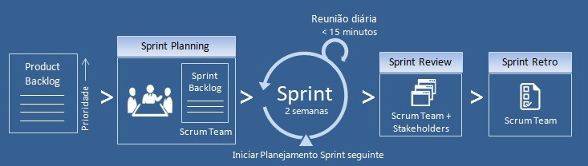
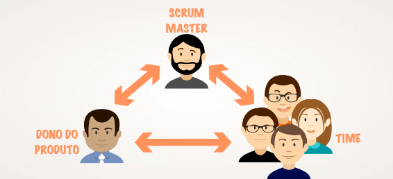
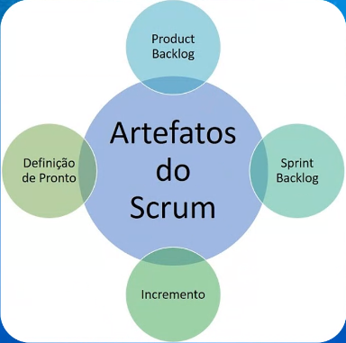

## SCRUM
framework para gerenciar projetos utilizando práticas e métodos ágeis durante todo o projeto.
SCRUM - não é uma sigla, e sim um nome dado a uma formação tática de um time de Rugby.

Link de Estudo: https://robsoncamargo.com.br/blog/Manifesto-Agil-entenda-como-surgiu-e-conheca-os-12-principios

	Empirismo - aprender com as proprias experiências
#### Pilares SCRUM
- Transparência
- Inspeção
- Adaptação

#### Valores Scrum
 - Foco
 - Coragem
 - Comprometimento
 - Respeito
 - Abertura
### EQUIPE SCRUM
#### Product Owner
pessoa que precisa entender melhor do produto e ter maior comunicação com o cliente.
#### Scrum Master
é o "Evangelista" do Scrum - responsável por aplicar eventos Scrum na empresa, ver se a equipe está seguindo os passos do Scrum corretamente.
#### Dev Team
Equipe de desenvolvedores

### Artefatos SCRUM
#### Product Backlog
documento que tem todas as listas de pendencias que o projeto/produto terá
definido pelo product Owner
#### Sprint backlog
definido pela equipe de desenvolvimento
atividades que serão trabalhadas dentro de um período de tempo.
#### Incremento
itens produzidos na sprint

### Cerimônias

#### Sprint
evento iterativo se repete ciclicamente
tempo definido 2 semanas, apresenta e começa de novo
#### Sprint Planning
evento que planeja quais itens serão trabalhados na sprint
leva de 4 a 8 horas.
#### Daily Scrum
reunião diária no mesmo local e mesmo horário
local abstrato
intenção de ver como está o andamento da Sprint
3 perguntas
- o que fiz ontem que vai gerar valor a sprint
- oq fazer hoje que vai gerar valor a sprint
- estou tendo algum impedimento
duração máxima 15 min
#### Sprint Review
apresentação do que foi desenvolvido na Sprint
PO, Cliente, equipe, Scrum Master - todos participam
#### Sprint Retrospective
acontece após a review
somente equipe e scrum master
Levantamento do que aconteceu durante a sprint de positivo e negativo
refletir e analisar para melhorar para a próxima
